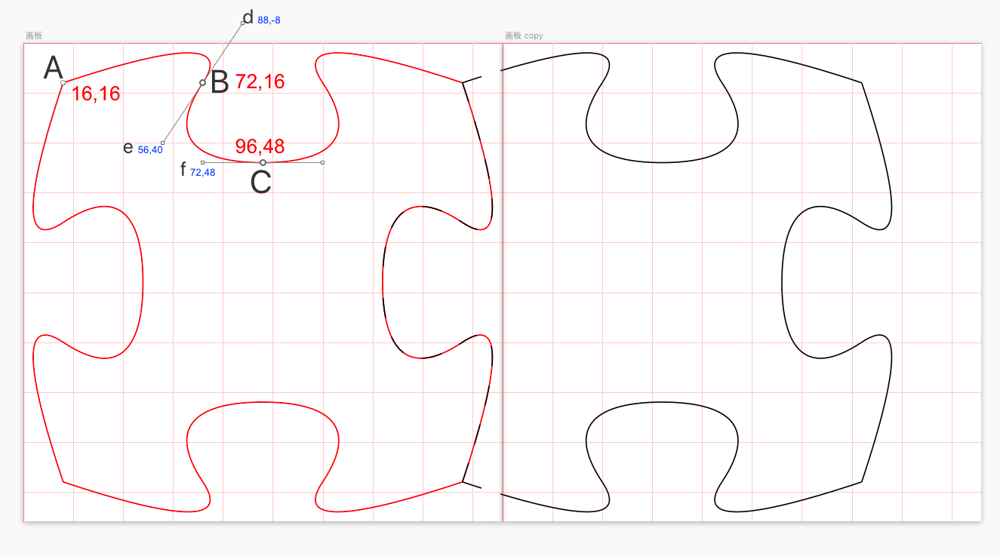

# SCJigsawPuzzle
拼图游戏(实现图片按路径切割，图片自动验证等功能）

## 效果图

## 项目特点

* 手机上的拼图游戏
* 可以自定义行列数
* 可以自选图片
* 使用贝塞尔曲线自定义图形

## 代码说明

以上坐标是UI给的，是画图的关键，如果有更好的方法欢迎提出。

- (**void**)addCurveToPoint:(CGPoint)endPoint controlPoint1:(CGPoint)controlPoint1 controlPoint2:(CGPoint)controlPoint2;

AB是第一条线段，A既是起点也是控制点1，d是控制点2，BC是第二条线段，ef分别是控制点1.2。通过这6个点加上坐标的旋转平移就能得到上面的图形了。

## 联系

Email：15756377633@163.com
Wechat：v268743

## License
The SCJigsawPuzzle project is available for free use, as described by the LICENSE (Apache 2.0).
